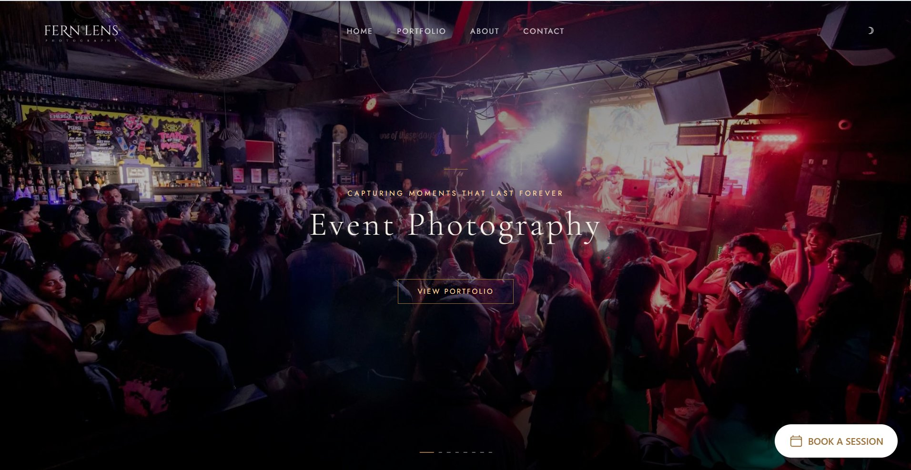
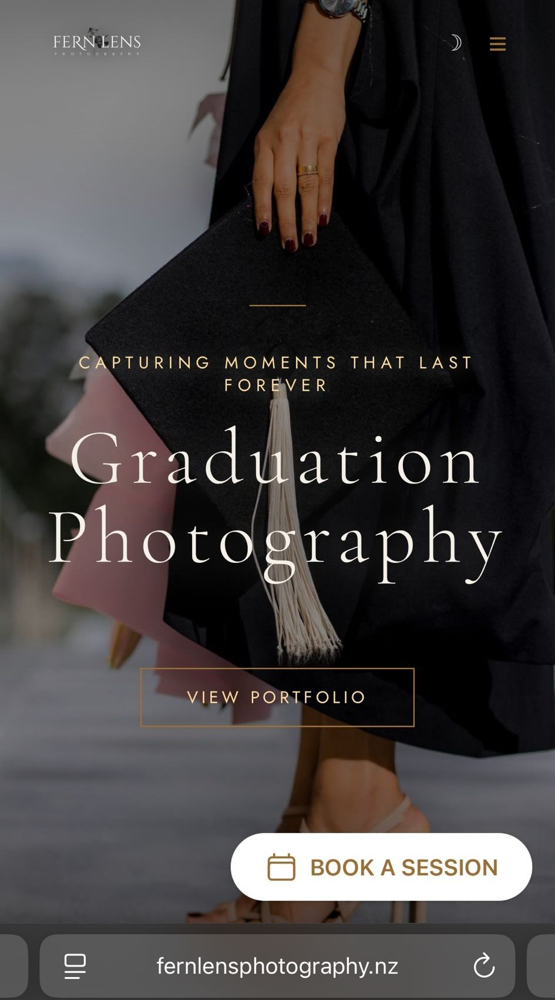

# 📸 Fern Lens Photography

> *Capturing moments that last forever.*

A professional photography portfolio website for **Fern Lens Photography**, showcasing event, graduation, and lifestyle photography. Built for elegance, speed, and a seamless booking experience across all devices.

🌐 **Live Site:** [fernlensphotography.nz](https://fernlensphotography.nz)

---

## 🖥️ Desktop Preview



---

## 📱 Mobile Preview



---

## ✨ Features

- **Full-screen hero slider** — Rotating photography categories with cinematic overlays (Event Photography, Graduation Photography, and more)
- **Portfolio gallery** — Curated collections organised by shoot type
- **Book a Session** — Persistent CTA button for easy client booking
- **Dark mode toggle** — Moon icon for comfortable browsing in low light
- **Fully responsive** — Optimised for desktop, tablet, and mobile
- **Minimal navigation** — Home · Portfolio · About · Contact

---

## 🗂️ Pages

| Page | Description |
|------|-------------|
| Home | Hero slider with category highlights and booking CTA |
| Portfolio | Gallery of event, graduation, and lifestyle shoots |
| About | Photographer bio and story |
| Contact | Enquiry form and social links |

---

## 🛠️ Tech Stack

| Layer | Technology |
|-------|------------|
| Frontend | HTML, CSS, JavaScript |
| Fonts | Serif display + sans-serif body |
| Hosting | Custom domain via fernlensphotography.nz |
| Responsive | Mobile-first CSS |

---

## 🚀 Getting Started

```bash
# Clone the repository
git clone https://github.com/your-username/fern-lens-photography.git

# Navigate into the project
cd fern-lens-photography

# Open in your browser
open index.html
```

> No build tools or dependencies required — pure HTML/CSS/JS.

---

## 📁 Project Structure

```
fern-lens-photography/
├── index.html          # Main entry point
├── css/
│   └── styles.css      # Global styles & responsive layout
├── js/
│   └── main.js         # Slider, dark mode, interactions
├── images/             # Photography assets
└── README.md
```

---

## 📬 Contact

For bookings and enquiries, visit [fernlensphotography.nz](https://fernlensphotography.nz) and click **Book a Session**.

---

*© Fern Lens Photography. All rights reserved.*